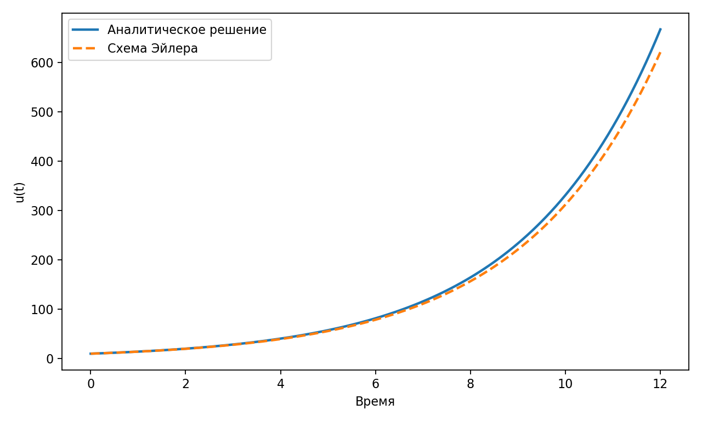
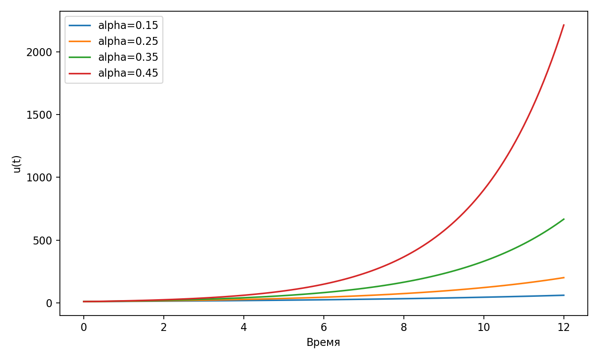

# Лабораторная работа 1. Экспоненциальный рост

<p align="center"><strong>ОТЧЁТ</strong></p>
<p align="center">по лабораторной работе №1</p>
<p align="center">«Подготовка стенда и первая дифференциальная модель»</p>
<p align="center">по дисциплине «Имитационное моделирование»</p>

| Параметр | Значение |
| --- | --- |
| Студент | Исаева Зарина Исмайилбековна |
| Группа | НКНбд–01–23 |
| Преподаватель | Кулябов Дмитрий Сергеевич, преподаватель дисциплины |
| Организация | Российский университет дружбы народов имени Патриса Лумумбы |
| Год | 2026 |

## Цель работы

Освоить структуру проекта, литературный стиль исходников и базовую модель экспоненциального роста.

## Постановка задачи

В рамках лабораторной работы необходимо:

- задать начальное значение популяции и коэффициент роста;
- построить аналитическое решение и численное приближение методом Эйлера;
- сравнить траектории двух подходов на общем графике;
- выполнить серию прогонов при разных значениях коэффициента роста.

## Теоретические сведения

Модель экспоненциального роста относится к базовым дифференциальным моделям и описывает процесс, в котором скорость изменения величины пропорциональна её текущему значению. Такая постановка применяется в демографии, эпидемиологии, экономике и при анализе ранних стадий распространения процессов без ограничивающих факторов.
Для лабораторной работы важно сопоставить точное аналитическое решение с численной схемой. Метод Эйлера прост в реализации и хорошо показывает, как шаг интегрирования и параметры модели влияют на точность вычислений, накопление ошибки и качество аппроксимации траектории.

## Исходные параметры и организация эксперимента

- начальное значение модели: u0 = 10.0;
- основной коэффициент роста: alpha = 0.35;
- горизонт моделирования: t_max = 12.0;
- шаг численного интегрирования: dt = 0.1;
- параметрический анализ проводится для alpha = 0.15, 0.25, 0.35, 0.45.

## Ход выполнения лабораторной работы

1. Подготовлен литературный источник с описанием модели и исполняемым кодом.
2. Реализованы формулы аналитического решения и итерационная схема Эйлера.
3. Сформированы CSV-файлы с основной траекторией и серией параметрических прогонов.
4. На основе табличных результатов автоматически построены итоговые графики.
5. По полученным данным сформированы отчёт, презентация и архив исходных материалов.

## Результаты моделирования


*Рисунок 1 — Сравнение аналитического решения и схемы Эйлера*


*Рисунок 2 — Влияние коэффициента роста на траекторию модели*

### Фрагмент таблицы основной траектории

|   time |   analytic |   euler |
|-------:|-----------:|--------:|
|    0   |     10     |  10     |
|    0.1 |     10.356 |  10.35  |
|    0.2 |     10.725 |  10.712 |
|    0.3 |     11.107 |  11.087 |
|    0.4 |     11.503 |  11.475 |
|    0.5 |     11.912 |  11.877 |
|    0.6 |     12.337 |  12.293 |
|    0.7 |     12.776 |  12.723 |

### Сводная таблица основных результатов

|   alpha |   Максимум |
|--------:|-----------:|
|    0.15 |    60.4965 |
|    0.25 |   200.855  |
|    0.35 |   666.863  |
|    0.45 |  2214.06   |

## Анализ и интерпретация результатов

- Сравнение аналитической траектории и схемы Эйлера показывает, что при небольшом шаге интегрирования численное решение воспроизводит форму точного решения и отклоняется постепенно по мере роста времени.
- С ростом коэффициента alpha кривая становится более крутой, а максимальное значение модели на фиксированном интервале быстро увеличивается. Это демонстрирует высокую чувствительность экспоненциальной модели к изменению параметров.
- Лабораторная работа служит базой для последующих более сложных моделей, где уже используются нелинейные взаимодействия, ограничение ресурсов или стохастические эффекты.

## Выводы

1. Построена и исследована базовая модель экспоненциального роста.
2. Показано различие между аналитическим решением и численным приближением методом Эйлера.
3. Подтверждено, что изменение коэффициента роста существенно влияет на скорость развития процесса.

## Листинг программы

```julia
# Этот файл сгенерирован автоматически из qmd-источника.

using DelimitedFiles
using Printf

results_dir = normpath(joinpath(@__DIR__, "..", "results", "data"))
mkpath(results_dir)

function write_csv(path, headers, rows)
    open(path, "w") do io
        println(io, join(headers, ","))
        for row in rows
            println(io, join(string.(row), ","))
        end
    end
end

u0 = 10.0
alpha = 0.35
t_max = 12.0
dt = 0.1
steps = Int(round(t_max / dt))

time = [i * dt for i in 0:steps]
analytic = [u0 * exp(alpha * t) for t in time]
euler = zeros(length(time))
euler[1] = u0
for i in 2:length(time)
    euler[i] = euler[i - 1] + dt * alpha * euler[i - 1]
end

rows = [[@sprintf("%.3f", time[i]), @sprintf("%.6f", analytic[i]), @sprintf("%.6f", euler[i])] for i in eachindex(time)]
write_csv(joinpath(results_dir, "growth_main.csv"), ["time", "analytic", "euler"], rows)

alpha_values = [0.15, 0.25, 0.35, 0.45]
sweep_rows = Vector{Vector{String}}()
for a in alpha_values
    for t in time
        push!(sweep_rows, [@sprintf("%.2f", a), @sprintf("%.3f", t), @sprintf("%.6f", u0 * exp(a * t))])
    end
end
write_csv(joinpath(results_dir, "growth_sweep.csv"), ["alpha", "time", "value"], sweep_rows)
println("lab01 done")
```

## Список литературы

1. Thomas Robert Malthus. An Essay on the Principle of Population. J. Johnson, 1798.
