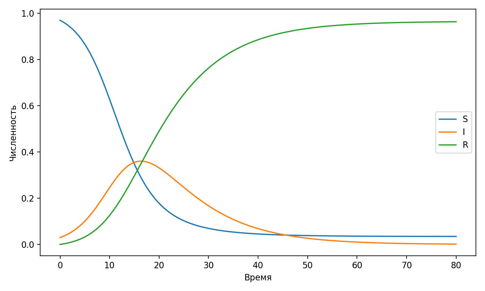
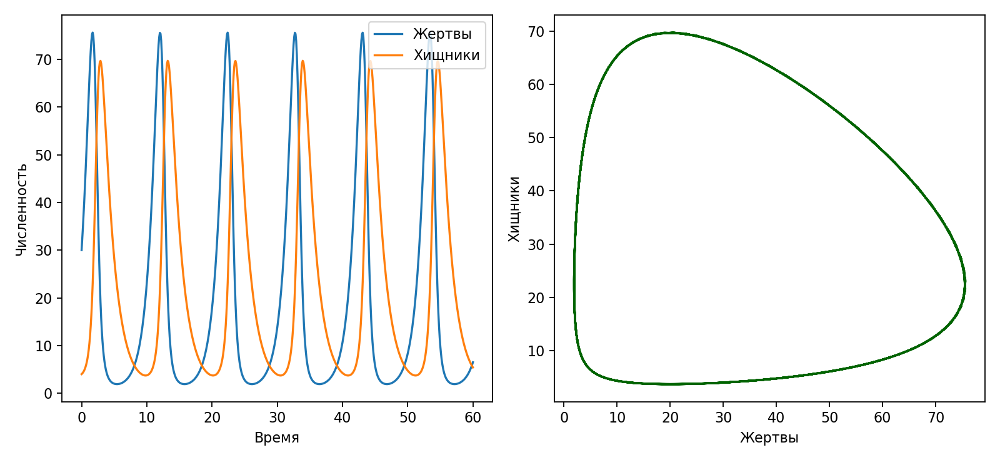

% Лабораторная работа 2. Основные модели
% Исаева Зарина Исмайилбековна
% Российский университет дружбы народов имени Патриса Лумумбы

# Лабораторная работа 2. Основные модели

- Дисциплина: Имитационное моделирование
- Студент: Исаева Зарина Исмайилбековна
- Группа: НКНбд–01–23
- Преподаватель: Кулябов Дмитрий Сергеевич

---

# Цель и задачи

- Исследовать детерминированные модели распространения инфекции и взаимодействия хищник–жертва.
- Подготовить литературный источник, чистый код, ноутбук, отчёт и презентацию.
- Провести вычислительный эксперимент и интерпретировать результаты.

---

# Ход выполнения

- Основной сценарий оформлен в `qmd`.
- Из него автоматически собираются `Julia`-скрипт и `ipynb`.
- Результаты сохраняются в `csv`, после чего строятся итоговые графики.

---

# Основной результат

*Динамика SIR-модели*

---

# Анализ чувствительности

*Фазовый портрет и временные ряды модели Лотки–Вольтерры*

---

# Ключевые численные результаты

- Показатель = Пик зараженных, Значение = 0.36
- Показатель = Время пика, Значение = 16.4

---

# Выводы

- Получена воспроизводимая лабораторная работа в едином академическом шаблоне.
- Подготовлены материалы для отчёта, презентации и публикации в репозитории.
- Результаты можно использовать для защиты и дальнейшего сравнения сценариев.
