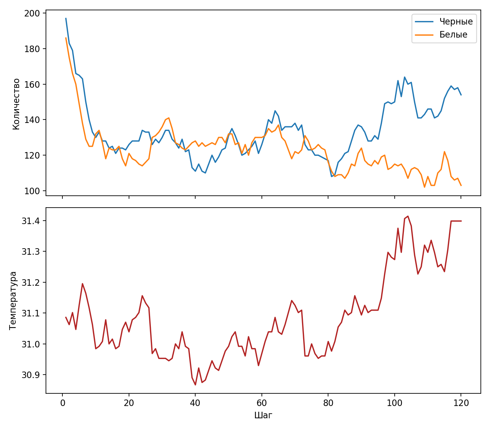
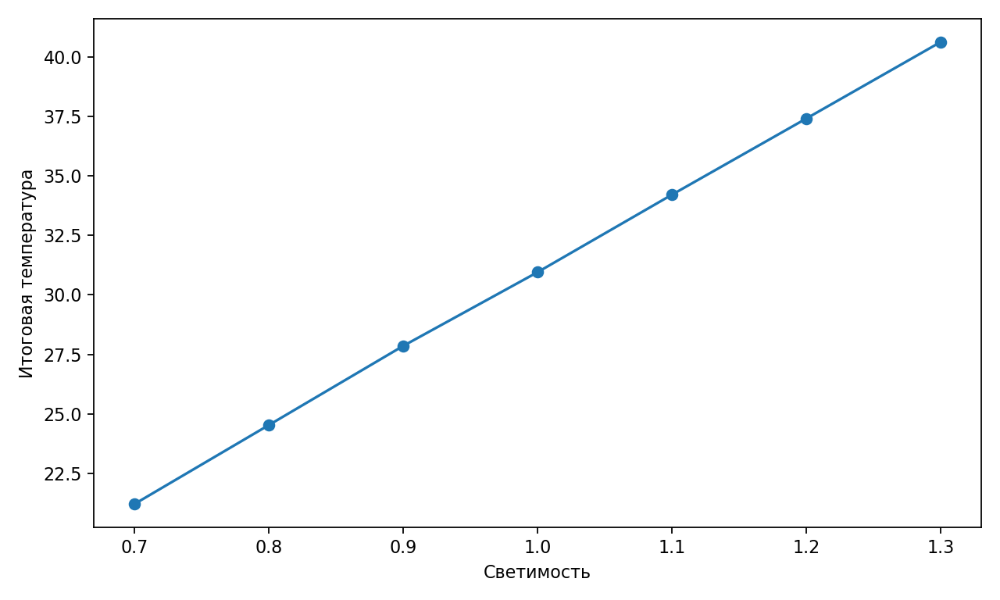

% Лабораторная работа 3. Агентное моделирование
% Исаева Зарина Исмайилбековна
% Российский университет дружбы народов имени Патриса Лумумбы

# Лабораторная работа 3. Агентное моделирование

- Дисциплина: Имитационное моделирование
- Студент: Исаева Зарина Исмайилбековна
- Группа: НКНбд–01–23
- Преподаватель: Кулябов Дмитрий Сергеевич

---

# Цель и задачи

- Построить агентную клеточную модель Daisyworld и изучить механизм климатической саморегуляции.
- Подготовить литературный источник, чистый код, ноутбук, отчёт и презентацию.
- Провести вычислительный эксперимент и интерпретировать результаты.

---

# Ход выполнения

- Основной сценарий оформлен в `qmd`.
- Из него автоматически собираются `Julia`-скрипт и `ipynb`.
- Результаты сохраняются в `csv`, после чего строятся итоговые графики.

---

# Основной результат

*Численность маргариток и температура среды во времени*

---

# Анализ чувствительности

*Зависимость итоговой температуры от светимости*

---

# Ключевые численные результаты

- luminosity = 0.7, final_temperature = 21.212, final_black = 204, final_white = 228
- luminosity = 0.8, final_temperature = 24.53, final_black = 194, final_white = 203
- luminosity = 0.9, final_temperature = 27.855, final_black = 163, final_white = 156
- luminosity = 1, final_temperature = 30.953, final_black = 129, final_white = 135
- luminosity = 1.1, final_temperature = 34.208, final_black = 90, final_white = 89

---

# Выводы

- Получена воспроизводимая лабораторная работа в едином академическом шаблоне.
- Подготовлены материалы для отчёта, презентации и публикации в репозитории.
- Результаты можно использовать для защиты и дальнейшего сравнения сценариев.
