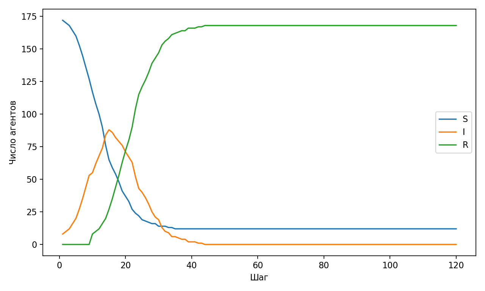
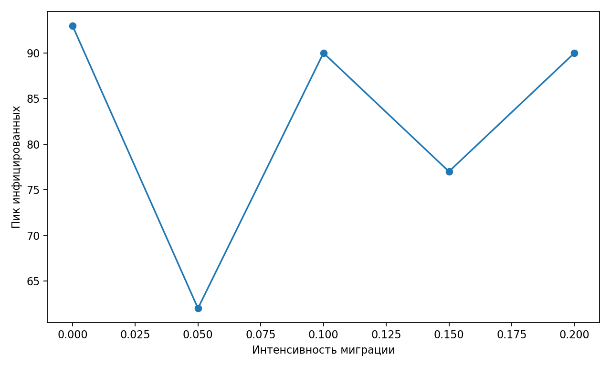

% Лабораторная работа 4. Агентный SIR
% Исаева Зарина Исмайилбековна
% Российский университет дружбы народов имени Патриса Лумумбы

# Лабораторная работа 4. Агентный SIR

- Дисциплина: Имитационное моделирование
- Студент: Исаева Зарина Исмайилбековна
- Группа: НКНбд–01–23
- Преподаватель: Кулябов Дмитрий Сергеевич

---

# Цель и задачи

- Реализовать агентную SIR-модель с несколькими городами и миграцией агентов.
- реализовать агентную SIR-модель с несколькими городами;
- учесть заражение внутри города, выздоровление и миграцию агентов;
- оценить влияние миграции на высоту эпидемического пика;

---

# Теоретическая основа

- В агентной SIR-постановке каждый объект системы хранит индивидуальное состояние, историю болезни и принадлежность к определённому пространственному кластеру. Это даёт возможность учитывать неоднородность контактов и пространственное перераспределение населения.
- В отличие от агрегированной дифференциальной модели, агентный подход позволяет естественно ввести миграцию и локальные процессы заражения. За счёт этого можно анализировать не только общую форму эпидемической волны, но и влияние структуры пространства на её развитие.

---

# Параметры эксперимента

- в модели используется совокупность агентов, распределённых по трём городам;
- каждый шаг учитывает локальное заражение, обновление длительности болезни и возможную миграцию;
- основной сценарий строится при фиксированной вероятности миграции;
- дополнительная серия прогонов выполняется для нескольких уровней межгородского обмена.

---

# Ход выполнения

1. Определена структура агента и набор его атрибутов.
2. Реализована процедура заражения по городам с расчётом вероятности инфицирования.
3. Добавлены механизмы выздоровления и случайной миграции между городами.
4. Сформированы временные ряды S, I и R для основного эксперимента.
5. Выполнен параметрический анализ по интенсивности миграции и подготовлены итоговые графики.

---

# Основной результат

*Динамика состояний S, I и R в агентной модели*

---

# Анализ чувствительности

*Влияние интенсивности миграции на пик инфекции*

---

# Ключевые численные результаты

- migration = 0, peak_infected = 93
- migration = 0.05, peak_infected = 62
- migration = 0.1, peak_infected = 90
- migration = 0.15, peak_infected = 77
- migration = 0.2, peak_infected = 90

---

# Фрагмент временного ряда агентной SIR-модели

|step|S|I|R|
|---|---|---|---|
|1|172|8|0|
|2|170|10|0|
|3|168|12|0|
|4|164|16|0|
|5|160|20|0|
|6|153|27|0|

---

# Интерпретация результатов

- Основная траектория SIR показывает последовательное снижение числа восприимчивых и рост/спад эпидемической волны в дискретном агентном времени.
- Рост интенсивности миграции приводит к более активному перемешиванию агентов и может повышать высоту эпидемического пика за счёт ускоренного переноса инфекции между городами.
- Полученные результаты демонстрируют, что пространственная структура и мобильность населения являются критически важными факторами для агентных эпидемиологических моделей.

---

# Выводы

- Построена агентная SIR-модель с учётом миграции между городами.
- Показано, что миграция заметно влияет на характеристики эпидемической волны.
- Модель может использоваться как основа для дальнейших сценарных исследований пространственной эпидемиологии.
