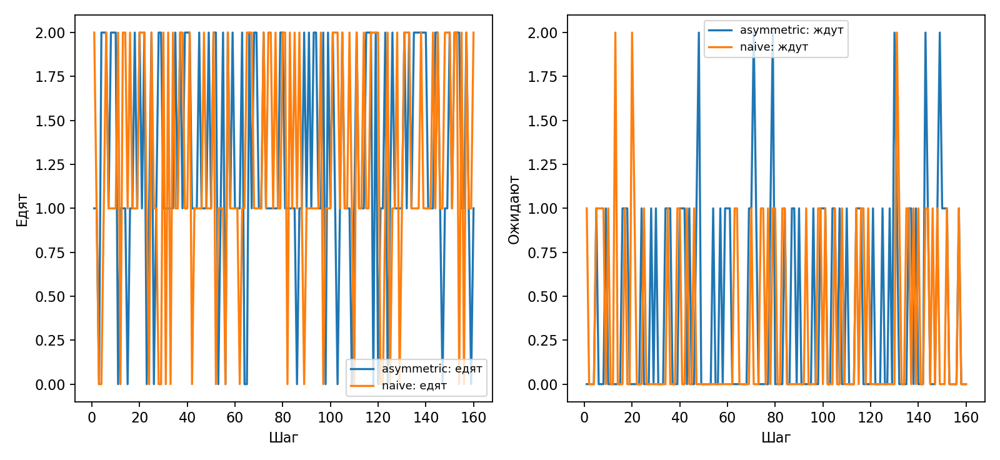
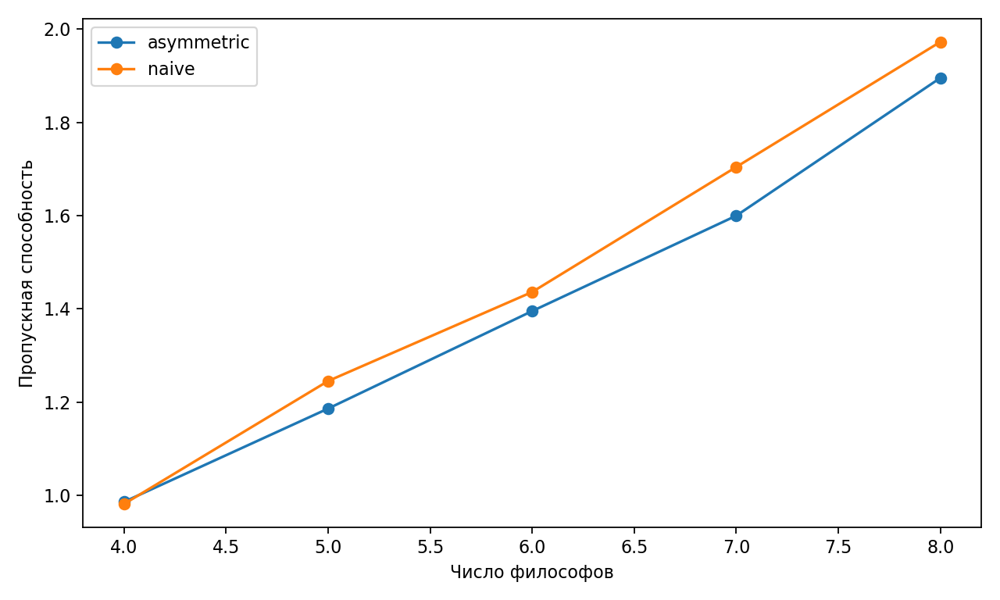

# Лабораторная работа 5. Сети Петри

<p align="center"><strong>ОТЧЁТ</strong></p>
<p align="center">по лабораторной работе №5</p>
<p align="center">«Задача обедающих философов»</p>
<p align="center">по дисциплине «Имитационное моделирование»</p>

| Параметр | Значение |
| --- | --- |
| Студент | Исаева Зарина Исмайилбековна |
| Группа | НКНбд–01–23 |
| Преподаватель | Кулябов Дмитрий Сергеевич, преподаватель дисциплины |
| Организация | Российский университет дружбы народов имени Патриса Лумумбы |
| Год | 2026 |

## Цель работы

Показать взаимосвязь маркировки сети Петри и проблем синхронизации на примере обедающих философов.

## Постановка задачи

В рамках лабораторной работы необходимо:

- смоделировать задачу обедающих философов средствами сети Петри;
- проследить изменение числа философов в состояниях ожидания и приёма пищи;
- сравнить стратегии синхронизации для разных размеров стола;
- оценить влияние выбранной схемы на пропускную способность модели.

## Теоретические сведения

Сети Петри используются для описания параллельных систем, в которых несколько процессов конкурируют за общие ресурсы. Они позволяют наглядно представить состояния системы в виде маркировки мест и переходов, а также анализировать взаимные блокировки и условия продвижения.
Задача обедающих философов является классическим примером проблемы синхронизации. В ней важно не только смоделировать факт захвата ресурсов, но и показать, как выбранная стратегия управления влияет на ожидание, вероятность конфликта и общую пропускную способность системы.

## Исходные параметры и организация эксперимента

- в модели рассматриваются альтернативные стратегии координации доступа к вилкам;
- по шагам фиксируется число философов, ожидающих ресурсы и находящихся в состоянии еды;
- в отдельной серии прогонов меняется размер стола, то есть количество философов;
- результаты агрегируются в таблицы состояний и пропускной способности.

## Ход выполнения лабораторной работы

1. Сформулирована логика сети Петри для сценария конкурентного доступа к ресурсам.
2. Для каждого шага симуляции сохранены показатели текущих состояний философов.
3. Выполнен сравнительный прогон нескольких стратегий синхронизации.
4. Построены графики ожидания/приёма пищи и зависимости пропускной способности от размера системы.
5. Сделаны выводы о предпочтительных правилах управления ресурсами.

## Результаты моделирования


*Рисунок 1 — Сравнение числа философов в состоянии ожидания и еды*


*Рисунок 2 — Сравнение пропускной способности стратегий для разных размеров стола*

### Фрагмент таблицы состояний философов

| strategy   |   step |   waiting |   eating |
|:-----------|-------:|----------:|---------:|
| naive      |      1 |         1 |        2 |
| naive      |      2 |         0 |        1 |
| naive      |      3 |         0 |        0 |
| naive      |      4 |         0 |        0 |
| naive      |      5 |         1 |        1 |
| naive      |      6 |         1 |        2 |
| naive      |      7 |         1 |        1 |
| naive      |      8 |         1 |        1 |

### Сводная таблица основных результатов

| strategy   |   philosophers |   throughput |
|:-----------|---------------:|-------------:|
| naive      |              4 |        0.982 |
| naive      |              5 |        1.246 |
| naive      |              6 |        1.436 |
| naive      |              7 |        1.704 |
| naive      |              8 |        1.973 |
| asymmetric |              4 |        0.986 |
| asymmetric |              5 |        1.186 |
| asymmetric |              6 |        1.396 |
| asymmetric |              7 |        1.6   |
| asymmetric |              8 |        1.896 |

## Анализ и интерпретация результатов

- График состояний показывает баланс между числом активно работающих агентов и числом участников, ожидающих доступ к общим ресурсам.
- На графике пропускной способности видно, что стратегии различаются по устойчивости при увеличении числа философов: часть из них лучше масштабируется, а часть быстрее уходит в перегруженный режим.
- Модель подтверждает, что сети Петри удобны для анализа синхронизации, взаимоблокировок и качества диспетчеризации ресурсов.

## Выводы

1. Сеть Петри успешно использована для формализации задачи обедающих философов.
2. Получено наглядное сравнение стратегий синхронизации по числу ожиданий и по пропускной способности.
3. Показана практическая ценность сетей Петри для анализа параллельных систем и конфликтов за ресурсы.

## Листинг программы

```julia
# Этот файл сгенерирован автоматически из qmd-источника.

using Random
using Printf

results_dir = normpath(joinpath(@__DIR__, "..", "results", "data"))
mkpath(results_dir)
Random.seed!(25)

function write_csv(path, headers, rows)
    open(path, "w") do io
        println(io, join(headers, ","))
        for row in rows
            println(io, join(string.(row), ","))
        end
    end
end

function simulate_philosophers(strategy; n = 5, steps = 160)
    state = fill(1, n)  # 1 think, 2 hungry, 3 eat
    eat_timer = fill(0, n)
    forks = fill(true, n)
    rows = Vector{Vector{String}}()
    meals = 0

    for step in 1:steps
        for p in 1:n
            if state[p] == 3
                eat_timer[p] -= 1
                if eat_timer[p] <= 0
                    state[p] = 1
                    left = p
                    right = p == 1 ? n : p - 1
                    forks[left] = true
                    forks[right] = true
                end
            elseif state[p] == 1 && rand() < 0.35
                state[p] = 2
            end
        end

        order = strategy == "naive" ? collect(1:n) : vcat(1:2:n, 2:2:n)
        for p in order
            if state[p] == 2
                left = p
                right = p == 1 ? n : p - 1
                if forks[left] && forks[right]
                    forks[left] = false
                    forks[right] = false
                    state[p] = 3
                    eat_timer[p] = 1
                    meals += 1
                end
            end
        end

        waiting = count(==(2), state)
        eating = count(==(3), state)
        push!(rows, [strategy, string(step), string(waiting), string(eating)])
    end
    return rows, meals / steps
end

state_rows = Vector{Vector{String}}()
for strategy in ("naive", "asymmetric")
    rows, _ = simulate_philosophers(strategy)
    append!(state_rows, rows)
end
write_csv(joinpath(results_dir, "philosophers_states.csv"), ["strategy", "step", "waiting", "eating"], state_rows)

sweep_rows = Vector{Vector{String}}()
for strategy in ("naive", "asymmetric")
    for n in 4:8
        _, throughput = simulate_philosophers(strategy, n = n, steps = 220)
        push!(sweep_rows, [strategy, string(n), @sprintf("%.4f", throughput)])
    end
end
write_csv(joinpath(results_dir, "philosophers_sweep.csv"), ["strategy", "philosophers", "throughput"], sweep_rows)
println("lab05 done")
```

## Список литературы

1. Tadao Murata. Petri Nets: Properties, Analysis and Applications. Proceedings of the IEEE, 1989.
