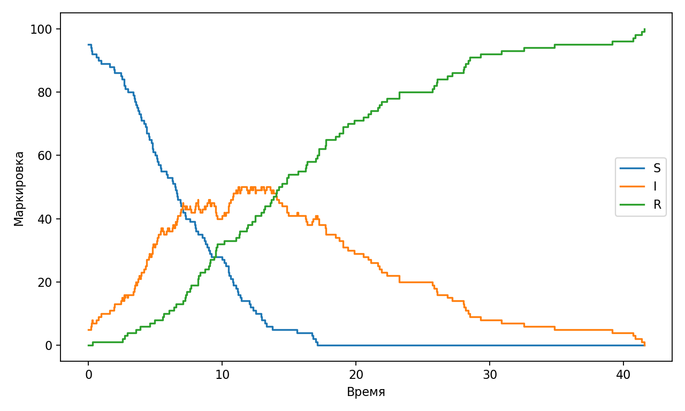
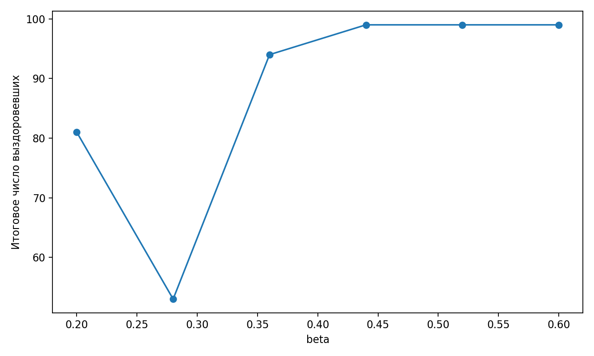

# Лабораторная работа 6. Сеть Петри для SIR

        **Дисциплина:** Имитационное моделирование  
        **Студент:** Исаева Зарина Исмайилбековна  
        **Группа:** Номер группы  
        **Преподаватель:** Кулябов Дмитрий Сергеевич, преподаватель дисциплины  
        **Организация:** Российский университет дружбы народов имени Патриса Лумумбы  
        **Год:** 2026

        ## Цель работы

        Исследовать SIR-модель, представленную в терминах мест, переходов и стохастических firing-событий.

        ## Теоретические сведения

        Работа опирается на классические результаты и подходы, описанные в литературе [@murata1989] [@kermack1927]. В рамках лабораторной работы использован литературный формат исходников: основной сценарий хранится в `qmd`, из него автоматически генерируются чистый `Julia`-код, ноутбук `ipynb` и документы для отчётности.

        ## Ход выполнения

        1. Подготовлен литературный источник в формате `qmd`.
        2. Из источника автоматически извлечён чистый исполняемый код `Julia`.
        3. Проведён вычислительный эксперимент и сохранены табличные результаты.
        4. На основе табличных данных построены иллюстрации и сводные таблицы.

        ## Результаты моделирования

        {#fig:lab06-main}

{#fig:lab06-sweep}

        Таблица основных результатов:

        |   beta |   final_recovered |
|-------:|------------------:|
|   0.2  |                81 |
|   0.28 |                53 |
|   0.36 |                94 |
|   0.44 |                99 |
|   0.52 |                99 |
|   0.6  |                99 |

        ## Анализ результатов

        График @fig:lab06-main показывает основную динамику модели, а @fig:lab06-sweep иллюстрирует чувствительность модели к изменению параметров. По полученным траекториям видно, что модель корректно воспроизводит ожидаемое качественное поведение системы и может использоваться для сравнительного анализа сценариев.

        ## Выводы

        В ходе выполнения лабораторной работы был получен воспроизводимый набор артефактов: литературный источник, исполняемый код, ноутбук, отчёт, презентация и архив исходных материалов. Автоматическая сборка позволяет быстро обновлять результаты после изменения параметров эксперимента.

        ## Список литературы
