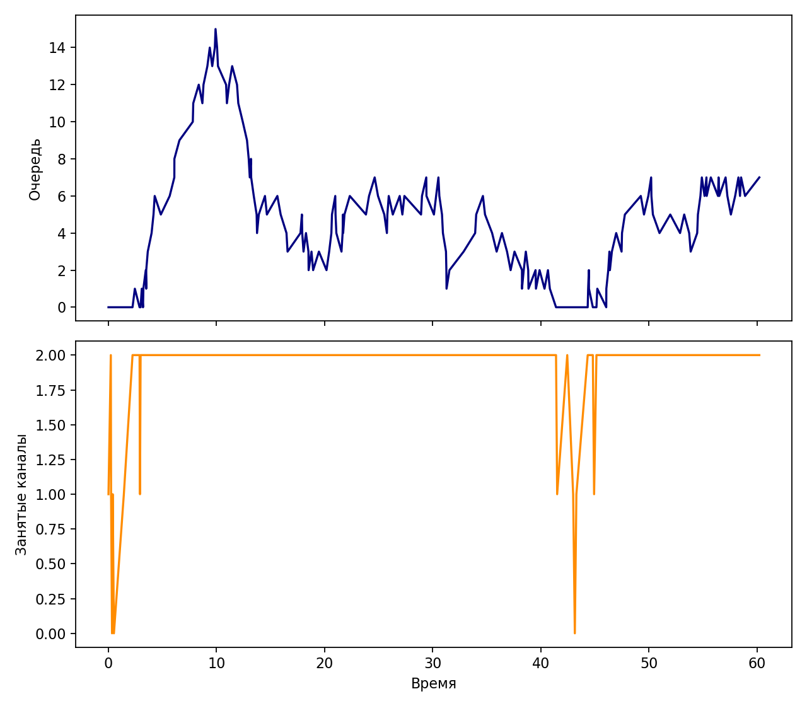
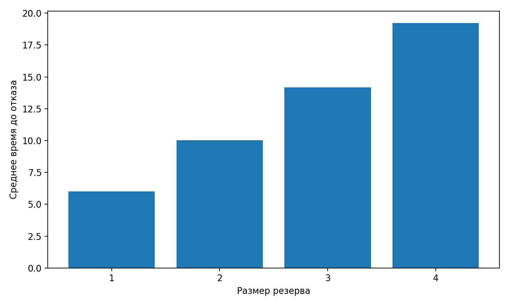

% Лабораторная работа 7. Дискретно-событийное моделирование
% Исаева Зарина Исмайилбековна
% Российский университет дружбы народов имени Патриса Лумумбы

# Лабораторная работа 7. Дискретно-событийное моделирование

- Дисциплина: Имитационное моделирование
- Студент: Исаева Зарина Исмайилбековна
- Группа: НКНбд–01–23
- Преподаватель: Кулябов Дмитрий Сергеевич

---

# Цель и задачи

- Смоделировать систему массового обслуживания и систему с резервом и ремонтом в событийнoм представлении.
- Подготовить литературный источник, чистый код, ноутбук, отчёт и презентацию.
- Провести вычислительный эксперимент и интерпретировать результаты.

---

# Ход выполнения

- Основной сценарий оформлен в `qmd`.
- Из него автоматически собираются `Julia`-скрипт и `ipynb`.
- Результаты сохраняются в `csv`, после чего строятся итоговые графики.

---

# Основной результат

*Очередь и загрузка в системе M/M/c*

---

# Анализ чувствительности

*Среднее время до отказа в модели Росса*

---

# Ключевые численные результаты

- reserve = 1, mean_crash_time = 6
- reserve = 2, mean_crash_time = 10.035
- reserve = 3, mean_crash_time = 14.194
- reserve = 4, mean_crash_time = 19.216

---

# Выводы

- Получена воспроизводимая лабораторная работа в едином академическом шаблоне.
- Подготовлены материалы для отчёта, презентации и публикации в репозитории.
- Результаты можно использовать для защиты и дальнейшего сравнения сценариев.
