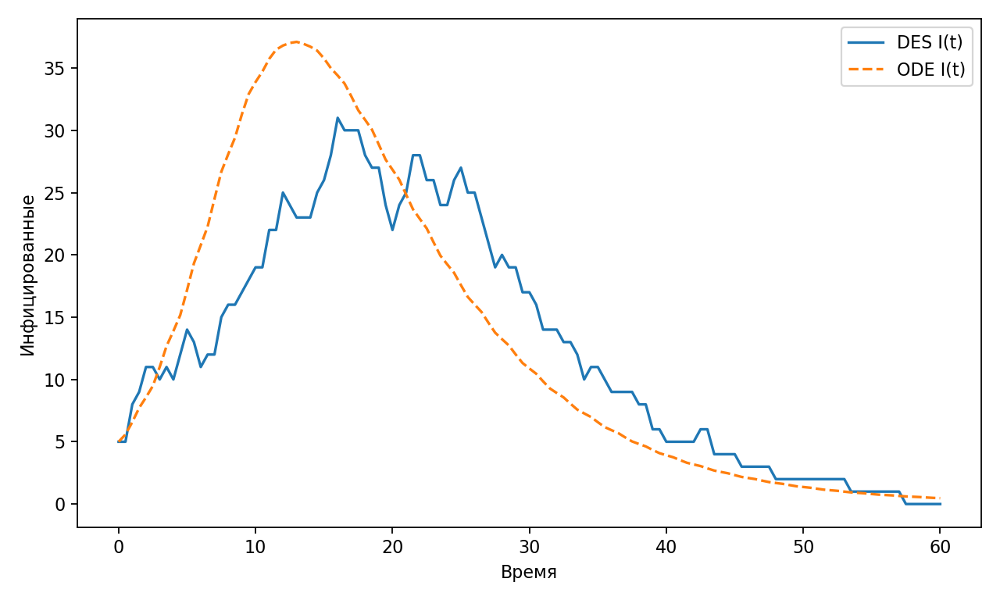
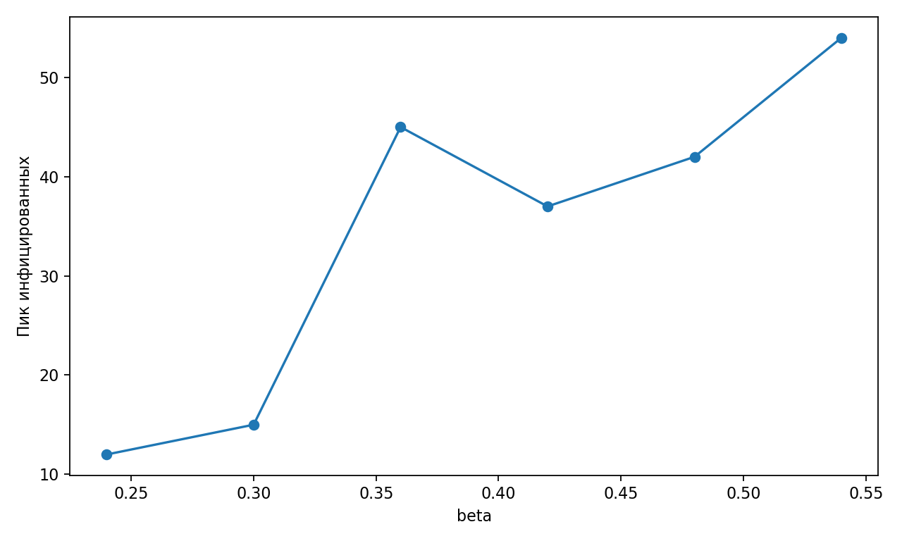

% Лабораторная работа 8. Дискретно-событийный SIR
% Исаева Зарина Исмайилбековна
% Российский университет дружбы народов имени Патриса Лумумбы

# Лабораторная работа 8. Дискретно-событийный SIR

- Дисциплина: Имитационное моделирование
- Студент: Исаева Зарина Исмайилбековна
- Группа: НКНбд–01–23
- Преподаватель: Кулябов Дмитрий Сергеевич

---

# Цель и задачи

- Сравнить дискретно-событийную SIR-модель с детерминированной кривой и анализом чувствительности.
- реализовать дискретно-событийную SIR-модель;
- сравнить её с детерминированной кривой инфицированных;
- исследовать влияние коэффициента заражения на пик эпидемии;

---

# Теоретическая основа

- Дискретно-событийная SIR-модель описывает распространение инфекции как последовательность индивидуальных событий заражения и выздоровления. Такой подход лучше отражает случайную природу взаимодействий и может демонстрировать отклонения от сглаженной детерминированной траектории.
- Сравнение с обычной системой дифференциальных уравнений полезно с методической точки зрения: оно позволяет увидеть, какие особенности добавляет событийная постановка и как случайность влияет на время и высоту эпидемического пика.

---

# Параметры эксперимента

- в основном эксперименте строятся две траектории: событийная и детерминированная;
- для анализа используются значения инфицированных во времени;
- в параметрической части варьируется коэффициент заражения beta;
- результаты сохраняются в сравнительные таблицы и графики.

---

# Ход выполнения

1. Подготовлены две взаимосвязанные модели: событийная и детерминированная.
2. Выполнен основной прогон с синхронной записью сравниваемых траекторий.
3. Сформирован набор экспериментов по коэффициенту заражения.
4. Построены графики сравнения и чувствительности модели к параметрам.
5. Подготовлена интерпретация различий между постановками.

---

# Основной результат

*Сравнение детерминированной и событийной траекторий*

---

# Анализ чувствительности

*Изменение пика инфекции при варьировании коэффициента заражения*

---

# Ключевые численные результаты

- beta = 0.24, peak_infected = 12
- beta = 0.3, peak_infected = 15
- beta = 0.36, peak_infected = 45
- beta = 0.42, peak_infected = 37
- beta = 0.48, peak_infected = 42

---

# Фрагмент таблицы сравнения событийной и детерминированной SIR-моделей

|time|I_des|I_det|
|---|---|---|
|0|5|5|
|0.5|5|5.586|
|1|8|6.579|
|1.5|9|7.718|
|2|11|8.564|
|2.5|11|9.481|

---

# Интерпретация результатов

- На сравнительном графике видно, что событийная траектория сохраняет общую форму детерминированной кривой, но демонстрирует локальные флуктуации и дискретность изменений.
- При увеличении beta эпидемический пик возрастает, что подтверждает ожидаемую чувствительность модели к интенсивности заражения.
- Работа показывает, что событийное моделирование даёт более вариативное и прикладное представление об эпидемическом процессе, особенно при конечной популяции.

---

# Выводы

- Проведено содержательное сравнение событийной и детерминированной SIR-моделей.
- Подтверждено влияние коэффициента заражения на высоту эпидемического пика.
- Событийная постановка показала свою полезность для анализа случайных эпидемических сценариев.
